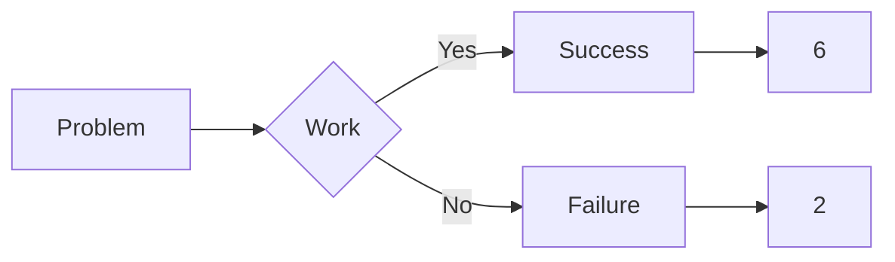

# Site de tutorials pour la classe d'OC 25-27

- [Manuel Python](https://my.flowershow.app/@corentinrordorf/python-markdown-theme-global/Markdown-Python)
- [Manuel Rapsberry](https://my.flowershow.app/@corentinrordorf/python-markdown-theme-global/Raspberry-Pi-Manual)

