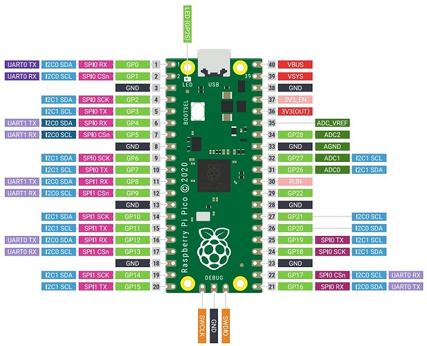

# Manuel pour le code de la raspberry Pi.

## Voilà la shéma du GPIO

## Code pour changer une allumer une led

## [Retour à la racine](https://my.flowershow.app/@corentinrordorf/python-markdown-theme-global)
