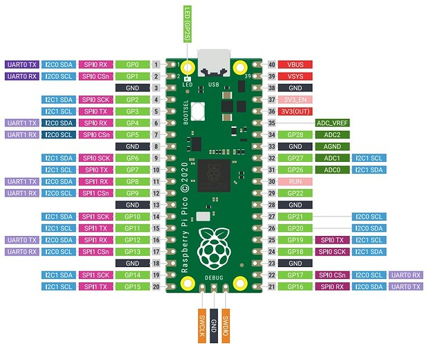

   # Manuel pour le code de la raspberry Pi.

## Voilà la shéma du GPIO



## Code pour allumer une led

```python
from machine import Pin
import time

led = Pin(15, Pin.OUT)

while True:
    led.value(1)      # LED ON
    time.sleep(1)
    led.value(0)      # LED OFF
    time.sleep(1)
```
   # Glossaire MicroPython pour Raspberry Pi Pico

   ##Imports et modules

from machine import Pin, PWM, ADC — Importe les classes nécessaires depuis le module machine pour contrôler le matériel (broches, PWM, lecture analogique).

import random — Importe le module pour générer des nombres aléatoires (utilisé par random.randint()).

import time ou from time import sleep — Importe les fonctions de gestion du temps (pauses, chronométrage).

   ##Broches (Pin)

Pin(x, Pin.OUT) — Configure la broche numéro x en sortie. Tu peux y envoyer du courant (allumer une LED, par exemple).

Pin(x, Pin.IN) — Configure la broche x en entrée. Tu peux lire un signal externe.

Pin(x, Pin.IN, Pin.PULL_UP) — Entrée avec résistance de tirage interne activée. Sans appui sur le bouton, la valeur lue est 1 (HIGH). Quand on appuie, elle passe à 0 (LOW). Ça évite les lectures instables.

   ##LEDs et valeurs

led.value(1) / led.value(0) — Allume (1) ou éteint (0) la LED connectée à cette broche.

led1.value() — Même chose, juste un nom de variable différent (led1, led2, etc.).

   ##PWM (Pulse Width Modulation)

PWM — Modulation de largeur d'impulsion. Permet de faire varier la puissance envoyée à un composant (luminosité d'une LED, position d'un servo) en alternant très vite entre ON et OFF.

pwm.freq(50) ou servo.freq(50) — Définit la fréquence du signal PWM en Hz. Pour un servomoteur, c'est toujours 50 Hz (50 impulsions par seconde).

duty — Le rapport cyclique : la proportion du temps où le signal est à l'état haut pendant chaque cycle. Plus le duty est élevé, plus la LED est brillante ou plus le servo tourne loin.

pwm.duty_u16(duty) — Définit le rapport cyclique avec une valeur entre 0 et 65535 (16 bits). 0 = toujours éteint, 65535 = toujours allumé.

led.duty_u16(valeur) / servo.duty_u16() — Même fonction appliquée à une LED ou un servo.

   ##Servomoteur

servo — Variable qui représente le servomoteur (c'est un objet PWM attaché à une broche).

set_angle(angle) — Fonction personnalisée qui convertit un angle (0–180°) en valeur de duty et l'envoie au servo pour le positionner.

setServoCycle(position) — Variante du même concept : envoie le servo à une position en degrés.

aller_a(position) — Autre fonction personnalisée : déplace le servo à une position donnée puis attend 1 seconde.

   ##Bouton

button — Variable représentant un bouton connecté à une broche.

button.value() — Lit l'état du bouton. Retourne 0 si appuyé (avec PULL_UP), 1 si relâché.

   ##Lecture analogique (potentiomètre)

ADC — Convertisseur Analogique-Numérique. Permet de lire une tension variable (comme celle d'un potentiomètre) et de la convertir en nombre.

pot — Variable représentant le potentiomètre (objet ADC).

pot.read_u16() — Lit la valeur du potentiomètre. Retourne un nombre entre 0 et 65535 correspondant à la tension (0V → 0, 3.3V → 65535).

   ##Temps et pauses

time.sleep(x) ou sleep(x) — Met le programme en pause pendant x secondes. sleep(0.5) = pause d'une demi-seconde.

time.ticks_ms() — Retourne le nombre de millisecondes écoulées depuis le démarrage. Utile pour mesurer des durées.

time.ticks_diff(stop, start) — Calcule la différence entre deux valeurs de ticks (pour obtenir une durée).

   ##Structures de contrôle

while True: — Boucle infinie. Le code à l'intérieur se répète sans fin jusqu'à ce qu'on éteigne ou redémarre le Pico.

   ##Fonctions utilitaires

return int() — Termine une fonction et renvoie une valeur convertie en entier (nombre sans décimales).

round(tension, 2) — Arrondit le nombre tension à 2 chiffres après la virgule.

convertir(valeur) — Fonction personnalisée qui transforme la lecture du potentiomètre (0–65535) en plage de duty pour le servo (1800–8200).

morse(mot) — Fonction personnalisée qui prend un mot et fait clignoter une LED en code Morse.

   ##Variables d'état

timerstarted — Variable booléenne (True/False) qui indique si le chronomètre est en cours. Sert à savoir si on a déjà commencé à mesurer un appui.

   ##Résumé visuel des valeurs

duty_u16 --> 0 – 65535 --> 0% – 100% du cycle

pot.read_u16() --> 0 – 65535 --> 0V – 3.3V

button.value() --> 0 ou 1 --> appuyé (0) / relâché (1) avec PULL_UP

servo à 50Hz --> ~1800 – 8200 (duty) --> 0° – 180°
